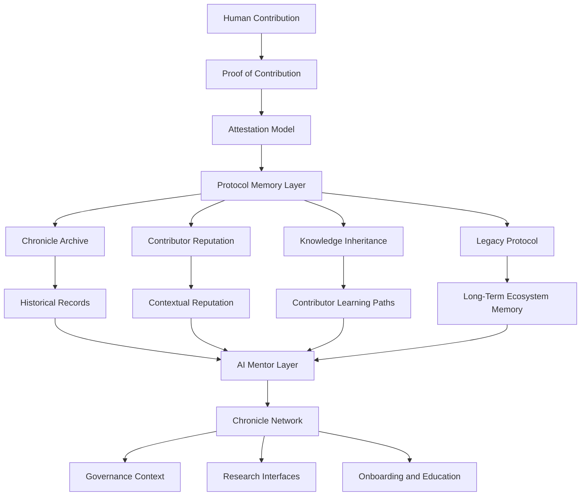

# Architecture Diagram

## Overview

This document provides a conceptual architecture diagram for Chronicle / Legacy Protocol. The diagram is not an implementation specification. It is a documentation-stage model showing how the main research components may relate to one another.

Chronicle / Legacy Protocol is organized around a Protocol Memory Layer. This layer receives verified contribution records, preserves ecosystem knowledge, supports contextual reputation, and enables future knowledge inheritance through human and AI-assisted interfaces.

## Conceptual Flow

## Layer Explanation

| Layer | Role |
|---|---|
| Human Contribution | Source of ecosystem work, including code, documentation, research, governance, education, and infrastructure |
| Proof of Contribution | Converts contribution claims into structured, evidence-aware records |
| Attestation Model | Defines how contributions are reviewed, validated, disputed, or accepted |
| Protocol Memory Layer | Core conceptual layer preserving verified contribution and ecosystem context |
| Chronicle Archive | Stores historical records, decisions, contribution events, and knowledge artifacts |
| Contributor Reputation | Interprets verified contribution history without reducing it to a transferable score |
| Knowledge Inheritance | Preserves lessons, reasoning, operational knowledge, and contributor experience |
| AI Mentor Layer | Helps users navigate archived knowledge with source-linked and uncertainty-aware assistance |
| Legacy Protocol | Maintains long-term memory while avoiding permanent hierarchy or closed contributor status |
| Chronicle Network | Broader coordination layer connecting archives, reputation, governance, research, and onboarding |

## Research Boundaries

This architecture should be read as a conceptual model. It does not claim that any smart contract, module, token, or production infrastructure currently exists. Future work should define data models, privacy controls, attestation schemas, governance safeguards, and implementation prototypes separately.

## Design Principle

The architecture begins with memory rather than rewards. Its purpose is to preserve verified human contribution and ecosystem knowledge before any incentive mechanism is considered.