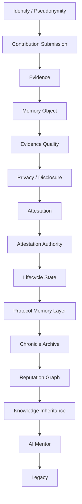
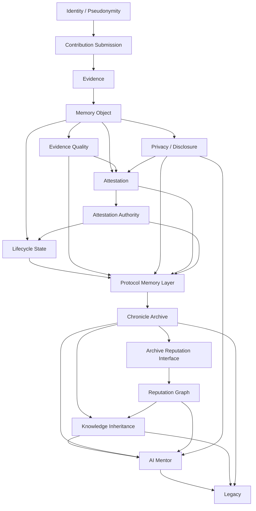

# Architecture Diagram

## Overview

This document provides a conceptual architecture diagram for Chronicle / Legacy Protocol. The diagram is not an implementation specification. It is a documentation-stage model showing how the main research components relate to one another according to the canonical architecture.

Chronicle / Legacy Protocol is organized around a Protocol Memory Layer. The central unit of this layer is the Memory Object: a structured record that preserves contribution, evidence, context, lifecycle state, and relationships to other ecosystem knowledge.

The authoritative system model is defined in the [Canonical Architecture Specification](./Canonical_Architecture_Specification.md).

## Canonical Conceptual Flow



This flow shows the canonical dependency order. A contribution is not attested directly in isolation. First, it is associated with an actor reference through a submission, supported by evidence, represented as a Memory Object, interpreted through evidence quality and privacy boundaries, reviewed through attestation, and then preserved and interpreted through lifecycle, archive, reputation, inheritance, AI mentor, and legacy layers.

## Expanded Layer Relationships



The expanded view shows that some layers provide constraints or context across multiple later layers. Evidence quality and privacy influence attestation, protocol memory, archive interpretation, reputation, inheritance, and AI mentor retrieval.

## Minimal Dependency Flow

```text
Identity -> Contribution Submission -> Evidence -> Memory Object -> Attestation -> Archive/Reputation -> Knowledge Inheritance -> AI Mentor -> Legacy
```

This simplified flow does not replace the full canonical architecture. It is a reader-friendly path for understanding how actor-linked ecosystem activity may become structured memory, reviewed context, reputation-aware lineage, and eventually source-linked learning support.

## Memory Object as the Architectural Center

The Memory Object is the main conceptual record used by Chronicle. It is not the contribution itself. It is a structured memory record that may describe a contribution, decision, knowledge artifact, governance event, or mentorship interaction.

A Memory Object may include evidence links, contributor identity references, attestation scope, evidence quality, privacy and disclosure context, lifecycle status, contextual tags, and relationships to other Memory Objects. This allows Chronicle to preserve not only that something happened, but also what evidence supports it, how it was reviewed, what disclosure boundaries apply, and how it connects to later knowledge.

## Layer Explanation

| Layer | Role |
|---|---|
| Identity / Pseudonymity | Provides actor continuity and attribution references without requiring real-world identity disclosure by default |
| Contribution Submission | Defines how a contribution enters Chronicle before it becomes protocol memory |
| Evidence | Provides source material supporting the existence, scope, or interpretation of a contribution or event |
| Memory Object | Structured record that represents contribution, evidence, context, lifecycle state, and relationships |
| Evidence Quality | Interprets the reliability, completeness, durability, and uncertainty of supporting evidence |
| Privacy / Disclosure | Defines disclosure, redaction, consent, and restricted-access boundaries |
| Attestation | Defines scoped review statements about a Memory Object, its evidence, or its claimed scope |
| Attestation Authority | Defines reviewer authority, attestation scope, accountability, and domain limits |
| Lifecycle State | Defines whether a record is draft, submitted, reviewed, accepted, verified, disputed, deprecated, rejected, inherited, or archived |
| Protocol Memory Layer | Core conceptual layer that organizes Memory Objects into durable ecosystem memory |
| Chronicle Archive | Preserves historical records, source references, decision context, and knowledge artifacts |
| Reputation Graph | Represents contextual reputation relationships without reducing contributors to a universal score |
| Knowledge Inheritance | Connects older Memory Objects to future learning, handoff, and research contexts |
| AI Mentor | Defines safe, source-linked, uncertainty-aware retrieval and explanation boundaries |
| Legacy | Represents long-term preservation of ecosystem memory, contribution lineage, governance reasoning, and knowledge continuity |

## Research Boundaries

This architecture should be read as a conceptual model. It does not claim that any smart contract, module, token, or production infrastructure currently exists. Future work should define data models, privacy controls, attestation schemas, governance safeguards, archival policies, and implementation prototypes separately.

## Design Principle

The architecture begins with memory rather than rewards. Its purpose is to preserve verified human contribution and ecosystem knowledge before any incentive mechanism is considered.
