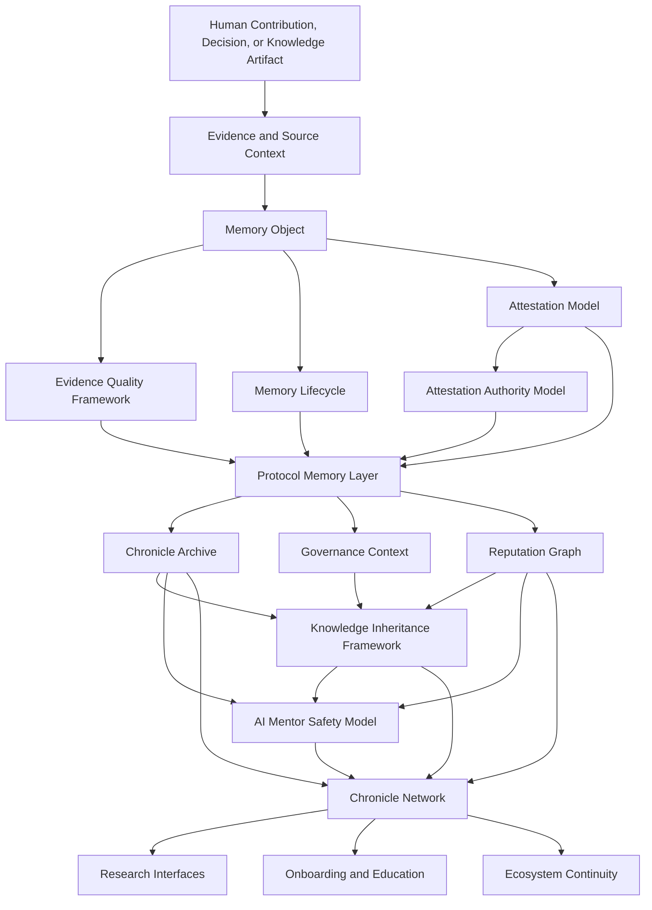

# Architecture Diagram

## Overview

This document provides a conceptual architecture diagram for Chronicle / Legacy Protocol. The diagram is not an implementation specification. It is a documentation-stage model showing how the main research components may relate to one another.

Chronicle / Legacy Protocol is organized around a Protocol Memory Layer. The central unit of this layer is the Memory Object: a structured record that preserves contribution, evidence, context, lifecycle state, and relationships to other ecosystem knowledge.

## Conceptual Flow



## Minimal Dependency Flow

```text
Contribution -> Evidence -> Memory Object -> Attestation -> Attestation Authority -> Reputation Graph -> Knowledge Inheritance -> AI Mentor
```

This simplified flow does not replace the full architecture. It is a reader-friendly path for understanding how raw ecosystem activity may become structured memory, reviewed context, reputation-aware lineage, and eventually source-linked learning support.

## Memory Object as the Architectural Center

The Memory Object is the main conceptual record used by Chronicle. It is not the contribution itself. It is a structured memory record that may describe a contribution, decision, knowledge artifact, governance event, or mentorship interaction.

A Memory Object may include evidence links, contributor identity references, attestation scope, evidence quality, lifecycle status, contextual tags, and relationships to other Memory Objects. This allows Chronicle to preserve not only that something happened, but also what evidence supports it, how it was reviewed, and how it connects to later knowledge.

## Layer Explanation

| Layer | Role |
|---|---|
| Human Contribution, Decision, or Knowledge Artifact | Source activity or context that may be worth preserving as ecosystem memory |
| Evidence and Source Context | Supporting material, source links, records, discussions, commits, proposals, or archived references |
| Memory Object | Structured record that represents contribution, evidence, context, lifecycle state, and relationships |
| Evidence Quality Framework | Interprets the reliability, completeness, and uncertainty of supporting evidence |
| Memory Lifecycle | Defines record states from creation through review, verification, dispute, archival, and deprecation |
| Attestation Model | Defines how records may be reviewed, accepted, disputed, rejected, or revised |
| Attestation Authority Model | Defines reviewer authority, attestation scope, accountability, and domain limits |
| Protocol Memory Layer | Core conceptual layer that organizes Memory Objects into durable ecosystem memory |
| Chronicle Archive | Preserves historical records, source references, decision context, and knowledge artifacts |
| Governance Context | Preserves reasoning, trade-offs, and decision history around governance activity |
| Reputation Graph | Represents contextual reputation relationships without reducing contributors to a universal score |
| Knowledge Inheritance Framework | Connects older Memory Objects to future learning, handoff, and research contexts |
| AI Mentor Safety Model | Defines safe, source-linked, uncertainty-aware retrieval and explanation boundaries |
| Chronicle Network | Broader coordination layer connecting archives, reputation, governance, research, and onboarding |

## Research Boundaries

This architecture should be read as a conceptual model. It does not claim that any smart contract, module, token, or production infrastructure currently exists. Future work should define data models, privacy controls, attestation schemas, governance safeguards, archival policies, and implementation prototypes separately.

## Design Principle

The architecture begins with memory rather than rewards. Its purpose is to preserve verified human contribution and ecosystem knowledge before any incentive mechanism is considered.
