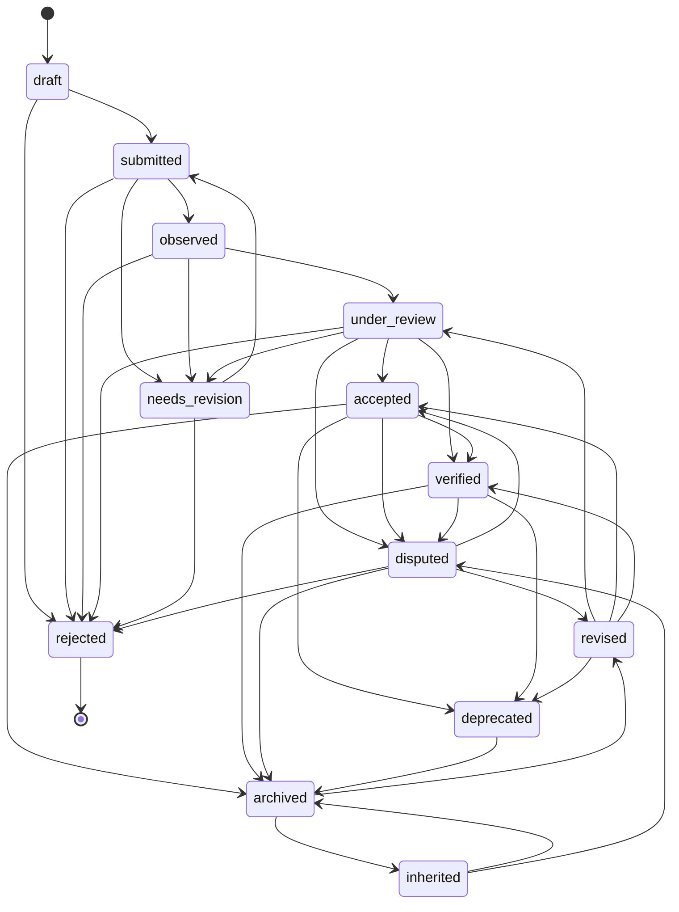

# Lifecycle State Machine

**Status:** Draft - Protocol Specification Candidate  
**Scope:** Chronicle / Legacy Protocol Memory Object lifecycle  
**Stage:** Concept and architecture research  
**Purpose:** Define the formal state model, allowed transitions, review gates, and lifecycle constraints for Memory Objects

## 1. Purpose

This document defines the lifecycle state machine for Chronicle / Legacy Protocol.

The existing [Memory Lifecycle](./Memory_Lifecycle.md) document explains lifecycle concepts in narrative form. This document translates that lifecycle into a more formal protocol-style model: states, transitions, actors, entry conditions, exit conditions, and invalid transitions.

The goal is to make Memory Object behavior predictable before any implementation, smart contract, database, or workflow engine is designed.

This document is not production code. It is a specification candidate.

## 2. Relationship to Canonical Architecture

The lifecycle state machine sits inside the canonical Chronicle flow:

```text
Contribution -> Evidence -> Memory Object -> Attestation -> Attestation Authority -> Lifecycle State -> Protocol Memory Layer
```

A Memory Object should not be interpreted without its lifecycle state. Lifecycle state determines whether a record is unfinished, submitted, observed, reviewed, accepted, verified, disputed, revised, deprecated, rejected, inherited, or archived.

The canonical architecture is defined in [Canonical Architecture Specification](./Canonical_Architecture_Specification.md).

## 3. Design Goals

The lifecycle state machine is designed to:

- prevent unreviewed records from being treated as verified memory;
- separate evidence existence from contribution significance;
- preserve review, dispute, revision, and archival history;
- support contextual reputation without reputation inflation;
- help AI mentor systems distinguish current, historical, disputed, and deprecated records;
- preserve ecosystem memory without freezing incorrect or outdated claims;
- provide a future basis for implementation workflows.

## 4. Lifecycle State Definitions

| State | Definition | Can Affect Reputation? | Can Be Used by AI Mentor? |
|---|---|---|---|
| `draft` | A Memory Object is being prepared and has not entered review | No | No, except as private or unfinished context |
| `submitted` | A Memory Object has been submitted with a claim and initial evidence | No or minimal | Only as unreviewed context |
| `observed` | Evidence exists and can be inspected, but significance has not been reviewed | No or weak | Yes, with clear limitation |
| `under_review` | Reviewers are evaluating accuracy, scope, evidence quality, privacy, and relevance | No or weak | Only with review-pending label |
| `needs_revision` | The object requires clearer evidence, narrower scope, or corrected context | No | Only as incomplete context |
| `accepted` | A relevant reviewer or process accepts the object within a defined scope | Yes, contextual | Yes, with scope and limitations |
| `verified` | Strong evidence and review support the object with no unresolved core dispute | Yes, stronger contextual | Yes, with source citation |
| `disputed` | The object, evidence, authorship, scope, or interpretation is challenged | Caution only | Yes, only with dispute label |
| `revised` | The object has been corrected, clarified, or updated after review or dispute | Depends on outcome | Yes, with revision context |
| `deprecated` | The object is historically visible but no longer current guidance | Historical only | Yes, with warning and replacement link |
| `rejected` | The object is false, unsupported, duplicated, abusive, or out of scope | No positive signal | No, except for abuse or historical analysis |
| `archived` | The object is preserved for historical memory and long-term retrieval | Historical/contextual | Yes, with archival context |
| `inherited` | The object is used as source context for later knowledge, learning, or lineage | Depends on source state | Yes, with lineage and source labels |

## 5. State Categories

Lifecycle states can be grouped into five operational categories.

| Category | States | Purpose |
|---|---|---|
| Preparation | `draft`, `submitted` | Prepare and submit candidate memory |
| Review | `observed`, `under_review`, `needs_revision` | Establish source existence, scope, and reviewability |
| Acceptance | `accepted`, `verified` | Mark records that can support contextual memory |
| Correction | `disputed`, `revised`, `deprecated`, `rejected` | Preserve uncertainty, correction, replacement, or invalidation |
| Continuity | `archived`, `inherited` | Preserve long-term discoverability and knowledge lineage |

## 6. Primary Transition Flow

The normal lifecycle path is:

```text
draft
-> submitted
-> observed
-> under_review
-> accepted
-> verified
-> archived
```

This path represents the cleanest case: a Memory Object is prepared, submitted with evidence, observed, reviewed, accepted, verified, and later archived.

Most real records will not follow this perfect path. Some will require revision, dispute handling, deprecation, rejection, or inheritance.

## 7. Allowed Transitions

| From State | Allowed To | Required Condition |
|---|---|---|
| `draft` | `submitted` | Minimum required fields and initial evidence are present |
| `draft` | `rejected` | Draft is spam, abusive, duplicate, or clearly out of scope |
| `submitted` | `observed` | Evidence source exists and can be inspected |
| `submitted` | `needs_revision` | Submission is incomplete, unclear, or missing reviewable context |
| `submitted` | `rejected` | Claim is unsupported, abusive, duplicate, or outside scope |
| `observed` | `under_review` | Evidence can be evaluated by an appropriate reviewer or process |
| `observed` | `needs_revision` | Evidence exists but claim scope or context is insufficient |
| `observed` | `rejected` | Evidence contradicts the claim or reveals invalid submission |
| `under_review` | `accepted` | Reviewer accepts the record within a defined scope |
| `under_review` | `verified` | Strong evidence and review support higher-confidence status |
| `under_review` | `needs_revision` | Reviewer requires correction or additional evidence |
| `under_review` | `disputed` | Reviewer or participant challenges accuracy, scope, or evidence |
| `under_review` | `rejected` | Review finds claim invalid, misleading, duplicate, or out of scope |
| `needs_revision` | `submitted` | Submitter updates the object and resubmits it |
| `needs_revision` | `rejected` | Required revision is not possible or claim remains invalid |
| `accepted` | `verified` | Additional evidence, review, or authority supports stronger confidence |
| `accepted` | `disputed` | A valid challenge is raised |
| `accepted` | `deprecated` | Record is no longer current but remains historically useful |
| `accepted` | `archived` | Record is preserved after active relevance changes |
| `verified` | `disputed` | New evidence or challenge affects the core claim |
| `verified` | `deprecated` | Strong record is superseded or no longer current guidance |
| `verified` | `archived` | Record is preserved for long-term memory |
| `disputed` | `revised` | Correction, clarification, or additional evidence is added |
| `disputed` | `accepted` | Dispute is resolved and record remains valid within scope |
| `disputed` | `rejected` | Dispute shows the record is invalid or harmful |
| `disputed` | `archived` | Disputed record is preserved for historical context |
| `revised` | `under_review` | Revised record requires another review cycle |
| `revised` | `accepted` | Revision resolves the issue and reviewer accepts the record |
| `revised` | `verified` | Revision plus evidence supports higher-confidence status |
| `revised` | `deprecated` | Revision identifies replacement or supersession |
| `deprecated` | `archived` | Deprecated record is preserved as historical context |
| `archived` | `revised` | Later correction or retrospective update is required |
| `archived` | `inherited` | Record becomes part of a knowledge lineage or learning path |
| `inherited` | `archived` | Inheritance use is preserved as historical lineage |
| `inherited` | `disputed` | Inheritance relationship or source interpretation is challenged |

## 8. Invalid Transitions

Some transitions should be considered invalid unless a future specification explicitly allows them.

| Invalid Transition | Reason |
|---|---|
| `draft` -> `accepted` | Review and evidence observation are skipped |
| `draft` -> `verified` | Verification cannot occur before submission and review |
| `submitted` -> `verified` | Evidence has not been observed or reviewed |
| `observed` -> `verified` | Existence is not the same as verified significance |
| `needs_revision` -> `verified` | Incomplete records require resubmission or review first |
| `rejected` -> `verified` | Rejected records must be revised and reviewed before any positive state |
| `rejected` -> `accepted` | Rejection cannot be bypassed without revision and review |
| `deprecated` -> `verified` | Deprecated records require revision before current confidence can be restored |
| `archived` -> `verified` | Archived records require revision or review before becoming active verified records |
| `inherited` -> `verified` | Inheritance does not itself verify the source record |

Invalid transitions protect Chronicle from treating incomplete, outdated, disputed, or rejected records as authoritative memory.

## 9. Review Gates

Review gates define the minimum checks required before important lifecycle transitions.

| Transition | Required Gate |
|---|---|
| `draft` -> `submitted` | Required fields gate |
| `submitted` -> `observed` | Evidence existence gate |
| `observed` -> `under_review` | Reviewability gate |
| `under_review` -> `accepted` | Scope acceptance gate |
| `accepted` -> `verified` | Strong evidence gate |
| `under_review` -> `rejected` | Rejection rationale gate |
| `accepted` -> `disputed` | Valid dispute gate |
| `disputed` -> `revised` | Correction evidence gate |
| `accepted` -> `deprecated` | Supersession or obsolescence gate |
| `archived` -> `inherited` | Lineage relevance gate |

### 9.1 Required Fields Gate

A Memory Object should not move from `draft` to `submitted` unless it includes:

- title;
- description;
- contributor or source reference;
- contribution or record type;
- at least one evidence reference or explanation of missing evidence;
- context tags;
- privacy or disclosure note where relevant.

### 9.2 Evidence Existence Gate

A Memory Object should not move from `submitted` to `observed` unless the evidence can be inspected or its absence is explicitly recorded.

Observation confirms existence, not value.

### 9.3 Reviewability Gate

A Memory Object should not move to `under_review` unless a reviewer can evaluate:

- what is being claimed;
- which evidence supports it;
- what scope is being requested;
- whether sensitive information is present;
- whether the object is duplicate, spam, or misleading.

### 9.4 Scope Acceptance Gate

A Memory Object should not become `accepted` unless the review outcome clearly states what was accepted.

Examples:

- authorship accepted;
- documentation usefulness accepted;
- governance relevance accepted;
- evidence existence accepted;
- educational value accepted;
- historical significance accepted.

Acceptance must be scoped. It should not imply universal importance.

### 9.5 Strong Evidence Gate

A Memory Object should not become `verified` unless it has stronger support than basic acceptance.

Possible requirements:

- durable public source;
- maintainer or domain reviewer confirmation;
- multiple independent evidence sources;
- low dispute risk;
- clear revision history;
- no unresolved challenge affecting the core claim.

### 9.6 Valid Dispute Gate

A dispute should identify at least one challenge type:

- authorship dispute;
- evidence dispute;
- scope dispute;
- usefulness dispute;
- privacy concern;
- duplicate claim;
- outdated record;
- misleading interpretation;
- governance interpretation conflict.

### 9.7 Lineage Relevance Gate

A Memory Object should not become `inherited` unless a later record clearly uses, extends, references, supersedes, or learns from it.

Inheritance requires relationship context, not just a link.

## 10. Actor Permissions by State

This table describes conceptual permissions. It does not define implementation access control.

| Actor | Typical Allowed Actions |
|---|---|
| Contributor | Create drafts, submit records, revise own submissions, provide evidence |
| Submitter | Submit candidate Memory Objects, respond to revision requests |
| Reviewer | Move observed records into review, request revision, accept, reject, or dispute within scope |
| Attestor | Issue scoped attestations after review |
| Domain Reviewer | Review specialized categories such as infrastructure, security, governance, localization, or research |
| Archivist | Archive, preserve metadata, mark availability, add redaction notes |
| Disputer | Challenge records, evidence, attestations, or inheritance relationships |
| Maintainer | Review repository-scoped or documentation-scoped records |
| Governance Participant | Review governance context, proposal history, and decision records |
| AI Mentor Interface | Retrieve records according to lifecycle state; cannot transition records |

AI systems should not perform lifecycle transitions. They may assist discovery, summarization, and review preparation, but not final state changes.

## 11. Lifecycle Effects on Other Layers

### 11.1 Reputation Graph

| State | Reputation Graph Effect |
|---|---|
| `draft` | No signal |
| `submitted` | No positive signal; pending context only |
| `observed` | Confirms activity exists, not contribution value |
| `under_review` | Weak pending signal only |
| `needs_revision` | No positive signal until resolved |
| `accepted` | Contextual positive signal within accepted scope |
| `verified` | Stronger contextual signal within domain and scope |
| `disputed` | Caution label; should not be treated as clean positive signal |
| `revised` | Depends on review outcome |
| `deprecated` | Historical signal only, not current authority |
| `rejected` | No positive signal |
| `archived` | Historical context; depends on prior state |
| `inherited` | Lineage signal; attribution may extend across related objects |

### 11.2 Chronicle Archive

Archive behavior should preserve lifecycle state rather than hiding it. Archived records may be accepted, verified, disputed, deprecated, or rejected. The archive should preserve that distinction.

### 11.3 Knowledge Inheritance

Knowledge Inheritance should prefer records that are accepted, verified, or historically useful. Disputed, deprecated, and rejected records may still be inherited only when the lesson depends on the dispute, failure, or historical correction.

### 11.4 AI Mentor

AI Mentor retrieval should respect lifecycle state:

- prefer `accepted` and `verified` for guidance;
- label `archived` as historical;
- label `deprecated` as outdated;
- explain `disputed` records with competing interpretations;
- avoid using `rejected` records as valid support;
- avoid presenting `submitted` or `observed` records as settled.

## 12. Minimal State Machine Diagram



## 13. State Record Requirements

Each lifecycle transition should preserve transition metadata.

| Field | Purpose |
|---|---|
| `from_state` | Previous lifecycle state |
| `to_state` | New lifecycle state |
| `transition_reason` | Human-readable explanation |
| `actor_id` | Contributor, reviewer, maintainer, archivist, or governance actor responsible for transition |
| `actor_role` | Role under which the transition was made |
| `timestamp` | Time of transition |
| `evidence_reference` | Evidence or review material supporting the transition |
| `attestation_reference` | Related attestation, if applicable |
| `dispute_reference` | Related dispute, if applicable |
| `revision_reference` | Related revision, if applicable |
| `scope_note` | Scope and limitations of the transition |

State transitions should not silently overwrite prior lifecycle history.

## 14. Privacy and Redaction Considerations

Lifecycle state changes may expose sensitive context. This is especially relevant for infrastructure evidence, mentorship interactions, governance disputes, and rejected or disputed claims.

The lifecycle model should support:

- redacted evidence references;
- private reviewer notes;
- limited visibility states;
- privacy-aware archival entries;
- contributor removal or redaction requests;
- clear separation between hidden evidence and missing evidence.

Privacy and redaction should not be treated as exceptions. They are expected requirements for a credible memory system.

## 15. Failure Modes

| Failure Mode | Description | Safeguard |
|---|---|---|
| Premature verification | Record becomes verified before evidence and review are sufficient | Strong evidence gate |
| Review bypass | Record moves from draft or submitted directly to accepted | Invalid transition rules |
| Reputation inflation | Submitted or observed records are treated as accepted | Lifecycle-aware reputation rules |
| Frozen falsehood | Incorrect accepted record cannot be challenged | Dispute and revision transitions |
| Archive confusion | Archived records appear current | Archive status labels and deprecation markers |
| AI overconfidence | AI uses weak or disputed records as authoritative | Lifecycle-aware retrieval policy |
| Reviewer capture | Reviewers accept low-quality records without accountability | Attestation Authority and dispute process |
| Privacy exposure | Review records expose sensitive information | Redaction and visibility controls |

## 16. Open Specification Questions

1. Which transitions require one reviewer versus multiple reviewers?
2. Which transitions can be automated safely, if any?
3. Should dispute windows have time limits?
4. Can rejected records be restored through revision, or must a new Memory Object be created?
5. What minimum evidence level is required for `accepted` versus `verified`?
6. Who can deprecate or supersede historically important records?
7. How should inherited records behave if a parent record becomes disputed?
8. Should lifecycle states be public by default?
9. How should private or redacted evidence affect state visibility?
10. What metrics can evaluate whether lifecycle rules reduce false memory and reputation inflation?

## 17. Summary

The Lifecycle State Machine formalizes how Memory Objects move through Chronicle / Legacy Protocol.

It defines the difference between unreviewed claims, observed evidence, reviewed records, accepted memory, verified memory, disputed records, rejected claims, archived history, and inherited knowledge.

This document moves Chronicle closer to protocol specification readiness by turning lifecycle concepts into explicit state rules. Future work should refine this model into formal schemas, validation logic, transition permissions, privacy controls, and implementation test cases.
